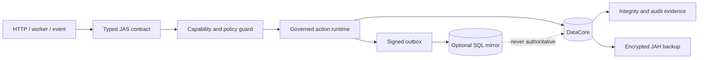

# JAS — JAH Action Script PHP

JAS is a 100% pure-PHP typed language and runtime layer. Its types, routines,
DataCore and official tooling contain no JavaScript or embedded foreign runtime.
External languages integrate out of process through JASB adapters, following the
same boundary as the C and C++ SDKs.

## A secure, typed application runtime for PHP

**Hackathon category:** Developer Tools
**Status:** working prototype, JAS 1.3.1
**Development workflow:** Codex SOL, Medium reasoning effort
**Build Week disclosure:** GPT-5.6 is part of the required hackathon evaluation,
not a JAS runtime dependency

JAS — JAH Action Script PHP is an organized, typed layer over PHP for building web
systems whose contracts, authorization, persistence and audit rules should not
depend on developer discipline alone. It targets the point where a normal PHP
application becomes difficult to sustain: many teams, many domains, long-lived
data, background work, permissions, recovery and regulatory evidence.

JAS provides a definition-first application model, a governed action runtime,
secure web primitives and DataCore, its native append-only database. The project
is written in PHP and intentionally makes **no OpenAI API calls at runtime**. AI
accelerated the engineering process; the resulting tool remains local,
inspectable and deterministic.

> JAS is not externally certified and should not be described as government-
> certified software. It implements security controls intended for serious
> enterprise and public-sector evaluation, but deployment still requires an
> independent threat model, audit and operational hardening.

## The problem

PHP is easy to start and difficult to govern at scale. Large applications often
accumulate implicit array shapes, authorization checks scattered across
controllers, direct database access, hidden cross-domain dependencies and
recovery procedures that exist only in a maintainer's memory.

JAS turns those concerns into explicit definitions:

- types are validated at action boundaries;
- domains own actions and declare dependencies;
- capabilities are checked before execution;
- audit and idempotency are runtime properties;
- DataCore is the single governed persistence entry point;
- full collection scans must be explicitly requested;
- SQL can be a migration bridge or read-only mirror, never a silent backdoor;
- backups, transactions and compaction have tested recovery paths.

## What works today

| Area | Implemented behavior |
|---|---|
| Application model | Types, domains, events, actions, capabilities and production validation |
| Runtime | Governed execution, object graphs, idempotency, WAL, outbox and recovery coordination |
| DataCore | Typed documents, encryption, integrity signatures, transactions and crash recovery |
| Enterprise data | Unique/compound/partial/range indexes, constraints, references and reversible migrations |
| Privacy | Per-subject encryption keys, cryptographic destruction evidence, retention and legal hold |
| SQL adoption | Signed outbox, PDO prepared statements, allowlists, versioned mirror and governed import |
| Continuity | Encrypted signed `.jahb` backups, empty-tree restore, retention and snapshot point-in-time |
| Web security | Governed router, CSRF, secure headers, rate limiting, safe HTML and forms |
| Scale foundations | Persistent queues, leases, backpressure, workers, sharding, quorum and fencing |
| Operations | Health probes, read-only secure panel, disk admission, retention and signed JASB telemetry export |
| Tooling | Generators, analyzer, Language Intelligence Engine, health checks and generated documentation |

Development follows the phase gates in
[`JAS_MASTER_PLAN.md`](JAS_MASTER_PLAN.md). Phases 1–8 are complete; the external
standard-LSP compatibility gate is active before security verification Phase 9.

## Architecture



DataCore is authoritative. The dotted SQL arrow represents an explicit security
boundary: arbitrary SQL changes are detected as divergence and are not imported.
The only inbound SQL path is a limited, allowlisted migration that requires two
different approvers and revalidates every row through DataCore contracts.

## Five-minute judge setup

### Requirements

- PHP 8.2 or newer
- Sodium extension
- PCNTL extension for workers and the complete test suite
- Linux is the currently verified platform
- No Composer, Node, npm, JavaScript or JSON artifacts are required or accepted

```bash
git clone https://github.com/esmeydub/JAS-JAH-Action-Script-PHP.git
cd JAS-JAH-Action-Script-PHP
cp .env.example .env
php bin/jas health
php tests/run_all.php
```

Expected final line:

```text
JAS SUITE: PASS
```

The suite includes positive, negative, concurrency, crash-recovery and tamper
tests. Its fuzz stage performs 500 valid round trips and rejects 500 corrupted
payloads.

### Run the reference web application

```bash
php -S 127.0.0.1:8080 examples/social_network.php
```

Open:

```text
http://127.0.0.1:8080/publicacion?id=POST-1
```

The example defines its types, domains, action contract, required capability,
audit behavior, handler and safe HTML response using public JAS APIs.

## Suggested three-minute demo path

1. Run `php bin/jas health` to show the local runtime and disabled external AI.
2. Open `examples/social_network.php` and show its typed action and capability.
3. Run the example and request one publication.
4. Run `php tests/test_datacore_database.php` to demonstrate DataCore controls.
5. Run `php tests/test_datacore_backup.php` to demonstrate tamper rejection and restore.
6. Show the SQL attack tests: malicious SQL values remain data and SQL changes do not contaminate DataCore.

## Codex SOL workflow and the role of GPT-5.6

The repository work documented here was performed in **Codex SOL** with
**Medium reasoning effort**. Codex SOL was the engineering workflow used to
inspect the inherited PHP prototype, build a normative phase plan, refactor
duplicated runtime concepts, implement missing security and recovery paths,
generate adversarial tests, execute the suite and document measured
limitations.

OpenAI Build Week requires the submission to explain its relationship with
**GPT-5.6**. For JAS, GPT-5.6 belongs to the hackathon's development-time review
and evaluation requirement; it is not embedded in the product and is not a
runtime dependency. This README does not relabel the Codex SOL work as a
GPT-5.6 session. A separate GPT-5.6 review or demo and its `/feedback` Session ID
must be reported in the submission only after that session has actually been
completed.

Important human-directed decisions were preserved throughout the work:

- the project is JAS — JAH Action Script PHP, not a generic PHP framework;
- no JSON or JavaScript artifacts exist in the engine;
- no external AI connector belongs in the JAS runtime;
- DataCore remains the source of truth;
- SQL Mirror exists to reduce adoption anxiety, but SQL remains untrusted;
- security and organization must be enforced by definitions and APIs;
- benchmarks must publish actual results, even when DataCore loses.

Codex was especially useful for maintaining a large cross-cutting change set:
transaction visibility, recovery ordering, signed journals, index behavior,
governed SQL migration, backup integrity and their negative tests were reviewed
as one system rather than isolated files.

## Measured evidence

Benchmarks are reproducible and are not universal performance claims.

### DataCore versus SQLite — local microbenchmark

PHP 8.4.22 on Linux, 2,000 records and 1,000 indexed reads:

| Engine | Write | 1,000 reads | Process CPU | Incremental peak | Disk |
|---|---:|---:|---:|---:|---:|
| DataCore | 0.926700 s | 280.437432 ms | 1.200917 s | 2.00 MiB | 4.66 MiB |
| SQLite | 0.008646 s | 3.243097 ms | 0.006756 s | 0 B observed by PHP | 361.93 KiB |

SQLite wins this microbenchmark. The measurement exposed a repeated index journal
read; caching reduced DataCore's 1,000 reads from about 1,623 ms to about 280 ms.
The full methodology and caveats are in
[`docs/DATACORE_BENCHMARKS.md`](docs/DATACORE_BENCHMARKS.md).

### Backup and restore — local microbenchmark

For 5,000 records: create 0.068148 s, verify 0.031700 s and restore
0.109296 s. The restored DataCore lookup passed. See
[`docs/DATACORE_BACKUP.md`](docs/DATACORE_BACKUP.md).

## Useful commands

```bash
php bin/jas health
php bin/jas disk:status
php bin/jas retention:run --force
curl --fail http://127.0.0.1/health/live
curl --fail http://127.0.0.1/health/ready
curl -H "Authorization: Bearer $JAS_OPERATIONS_TOKEN" http://127.0.0.1/operations
php bin/jas test
php bin/jas make:project /tmp/jas-demo "JAS Demo"
php bin/jas analyze /tmp/jas-demo
php bin/jas audit:verify
php bin/jas events:verify
php benchmarks/datacore_sql.php 2000
php benchmarks/datacore_backup.php 5000
```

La ruta completa, desde el proyecto vacío hasta documentación y verificación de
compatibilidad, está en [Crear una aplicación JAS funcional](docs/JAS_GETTING_STARTED.md).

## Repository guide

- `src/JAS/` — typed definitions, runtime, security, web, queues and cluster primitives
- `src/DataCore/` — database, transactions, indexes, SQL Mirror and continuity
- `examples/social_network.php` — smallest complete governed web example
- `tests/` — executable security, recovery, fuzz and integration evidence
- `benchmarks/` — reproducible local measurements
- `docs/` — subsystem and operational documentation
- `sdk/` — experimental C and C++ protocol SDKs
- `JAS_MASTER_PLAN.md` — ordered completion plan and phase evidence

## Security model and limitations

- The engine uses native JAH/PHP and JASB formats and rejects JSON/JavaScript artifacts.
- Secrets belong in `.env`; the file is ignored by Git.
- Sensitive DataCore fields can be encrypted and cannot be exposed to SQL Mirror.
- Signed evidence detects alteration; it does not prevent host-level compromise.
- Snapshot point-in-time currently has snapshot granularity, not per-WAL-event precision.
- New systems use encrypted DataCore institutional identity; the older flat-file
  `AuthStore` remains only as a compatibility provider.
- Production deployment requires key management, least-privilege filesystem
  accounts, monitoring, external review and disaster exercises for the target environment.

Security architecture is documented in
[`docs/DATACORE_DATABASE.md`](docs/DATACORE_DATABASE.md),
[`docs/DATACORE_SQL_MIRROR.md`](docs/DATACORE_SQL_MIRROR.md) and
[`JAS_ARCHITECTURE.md`](JAS_ARCHITECTURE.md).

## License

MIT — see [`LICENSE`](LICENSE).
